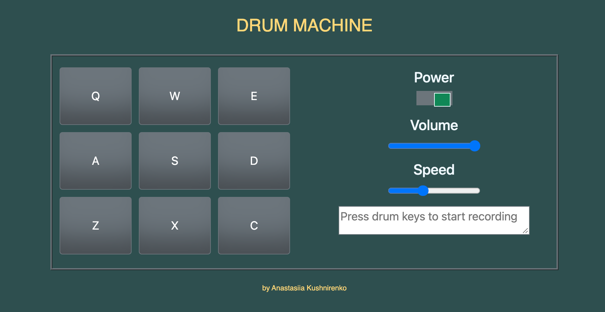
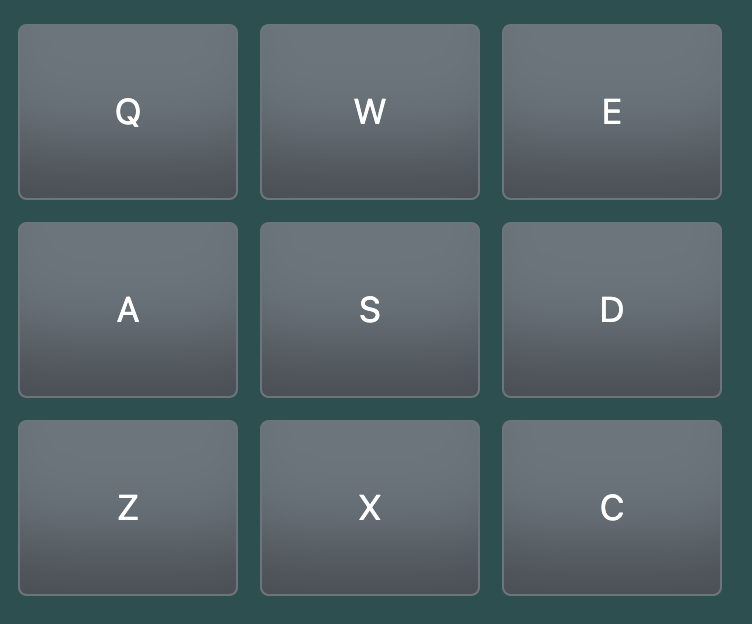
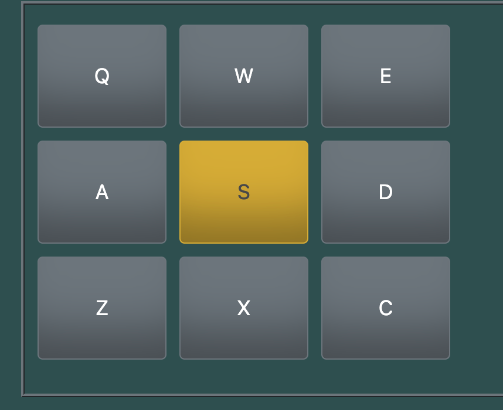
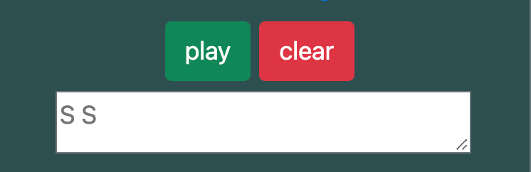

## Drum Machine 
The drum machine simulator, where you can create, save and record your drum sound patterns.



## Installation and Setup Instructions 
Clone down this repository. You will need node and npm installed globally on your machine.

Installation:  
```
npm install
```

To Start Server:  
```
npm start
```

To Visit App:  
```
localhost:3000
```

## Reflection
The project was created to put my front-end development skills to test what I've learned up to this point. I used a mix of HTML, JavaScript, JSX, CSS, Bootstrap, and React to complete it. 

Originally I wanted to build an application that simulates a realistic percussion experience. Then I added some additional features like adjusting the speed and the volume of the sound, I also implemented the power button and the possibility to record and play the recording. 

I chose the `create-react-app` boilerplate to minimize the initial setup and invest more time in diving into writing the code. 

Working on this project, I learned how to incorporate JSX directly inside JavaScript functions, specifically mapping an array to JSX elements. I used Hooks – `useState` for a better state performance, useContext to keep data in a single location, `useEffect` to catch events after rendering. I also improved toggle functions with `useReducer`.


## How the app logic works
– There are 9 clickable `drum-pad` elements, set up to trigger, and an inner text corresponds to one of the following keys on the keyboard: Q, W, E, A, S, D, Z, X, C.
 


– Within each `drum-pad`, there is an HTML5 audio element that has an ‘src’ attribute pointing to an audio clip. When the `drum-pad` element is clicked, the audio clip contained in its child audio element is triggered (e.g. pressing the Q key triggers the `drum-pad` which contains the string Q, and pressing the W key triggers the `drum-pad` which contains the string W, etc.).

– When a `drum-pad` is triggered, the button becomes active for a second.



– When a `drum-pad` is triggered, a string describing the associated audio clip is displayed as the inner text of the `recording` element. The `play` and `clear` buttons appear, allowing to reproduce the track or clear the `recording` element.



– There is a `power` button that allows you to turn on or turn the drum machine off, enabling all the buttons.

<br>


– The `volume` button adjusts the volume of each clip clicked and the recording itself when clicking on the `play` button.


– The `speed` button regulates the speed of the recording when clicking on the `play` button.


## Acknowledgments

[Bootstrap](https://getbootstrap.com/docs/4.0/getting-started/webpack/ ) 
